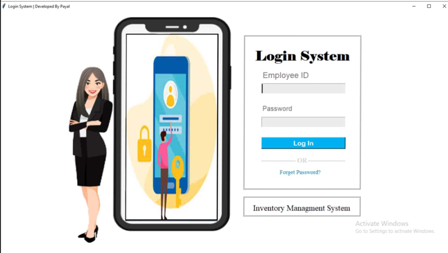
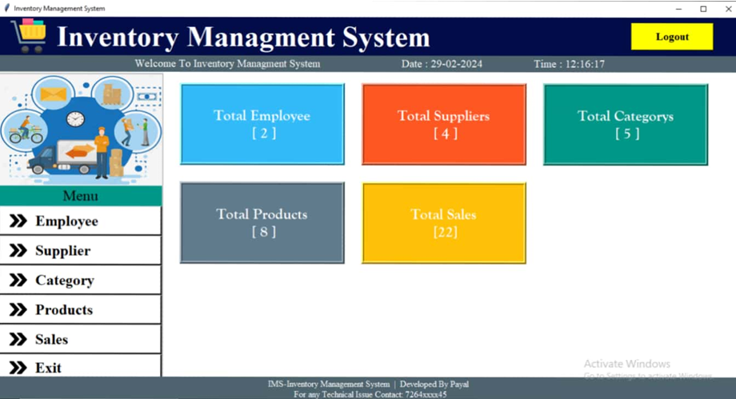
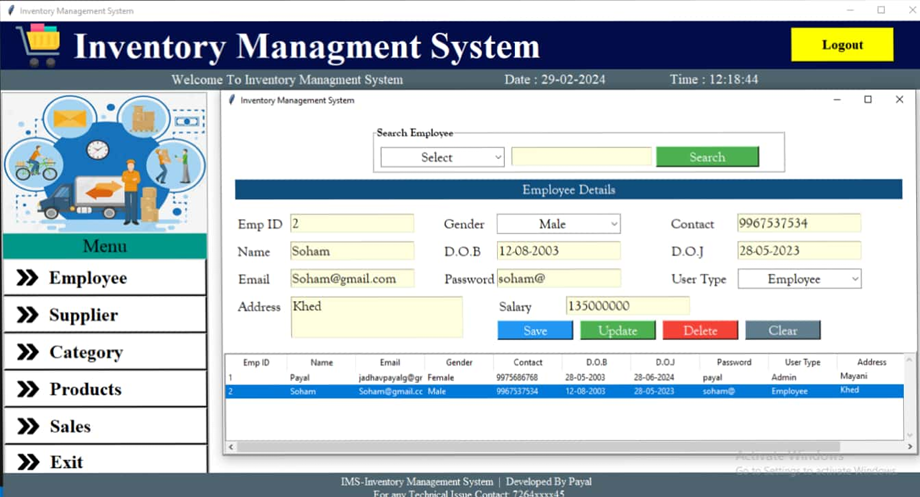
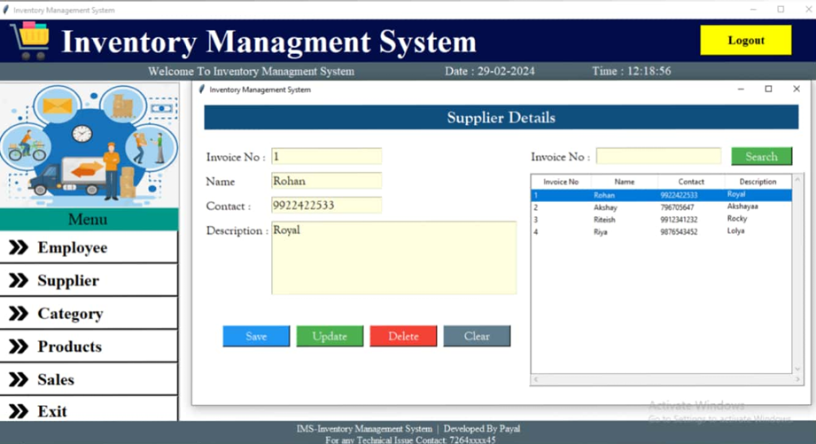
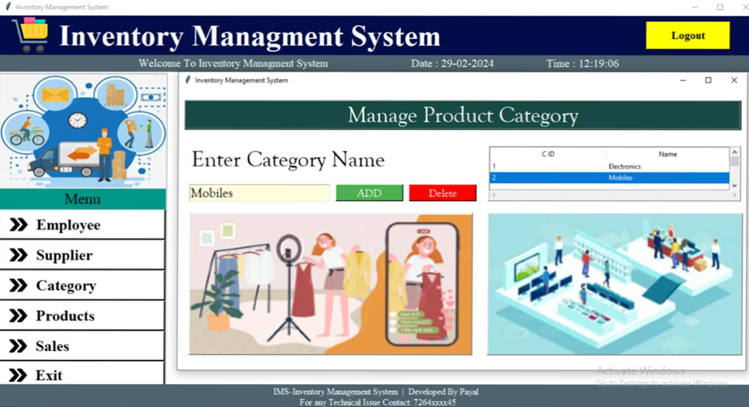
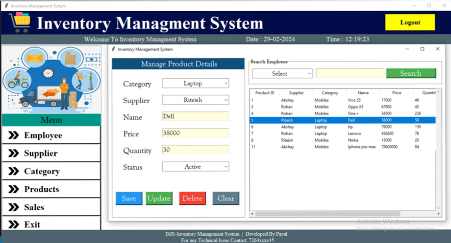
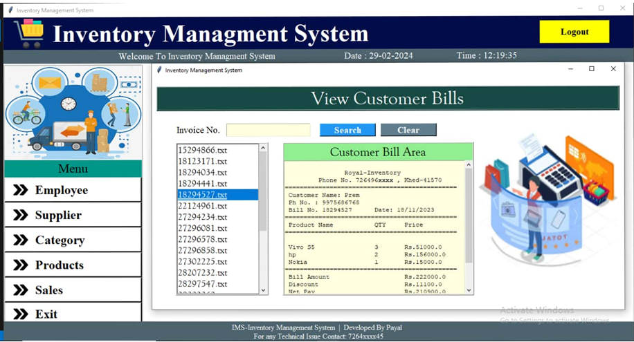
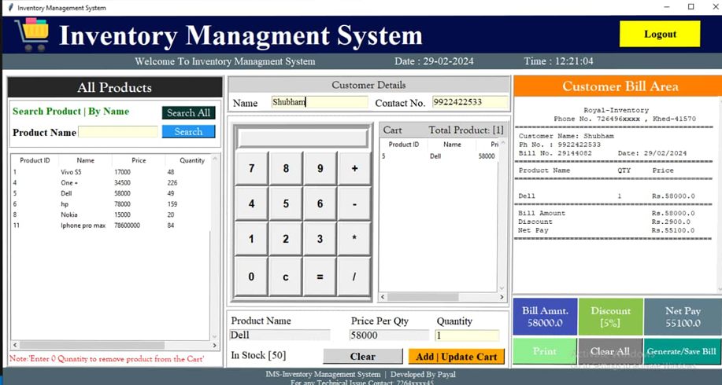

# ⚡ ElectroStock

### Smart Inventory Management System

Manage Products • Employees • Suppliers • Sales • Billing

---

## 🌟 Overview

ElectroStock is a desktop-based Inventory Management System developed using Python, Tkinter, and MySQL. The system streamlines inventory operations by providing efficient management of products, suppliers, employees, sales, and billing through a modern graphical user interface.

---

## ✨ Features

* 🔐 Secure Authentication System
* 👨‍💼 Employee Management
* 🚚 Supplier Management
* 📂 Category Management
* 📦 Product Management
* 💰 Billing & Sales Tracking
* 📊 Dashboard Analytics
* 📧 OTP-Based Password Recovery
* 🗄️ MySQL Database Integration

---

## 🛠️ Tech Stack

| Technology | Purpose                 |
| ---------- | ----------------------- |
| Python     | Application Development |
| Tkinter    | GUI Development         |
| MySQL      | Database Management     |
| Pillow     | Image Processing        |
| SMTP       | Email Verification      |

---

## 📸 Screenshots

<h1 align="left">🔑 Login Page</h1>

  

<h1 align="right">📊 Dashboard</h1>

  

<h1 align="left">👨‍💼 Employee Management</h1>

  

<h1 align="right">🚚 Supplier Management</h1>

  

<h1 align="left">📂 Category Management</h1>

  

<h1 align="right">📦 Product Management</h1>

  

<h1 align="left">💰 Sales Management</h1>

  

<h1 align="right">🧾 Billing System</h1>

  

## 🎯 Key Modules

### 🔐 Authentication System

Secure user login with OTP-based password recovery and email verification.

### 👨‍💼 Employee Management

Manage employee records with add, update, search, and delete functionality.

### 🚚 Supplier Management

Maintain supplier information and streamline vendor management.

### 📂 Category Management

Organize products efficiently using category-based inventory classification.

### 📦 Product Management

Track inventory, monitor stock levels, and manage product information.

### 💰 Sales & Billing System

Generate invoices, manage transactions, and maintain billing history.

### 📊 Dashboard Analytics

Access real-time business insights including products, employees, suppliers, and sales statistics.

### 🗄️ MySQL Database Integration

Reliable and secure data storage with efficient record management.

---

## 🚀 Future Enhancements

* 🔍 Barcode & QR Code Scanner Integration
* 📄 PDF Invoice & Report Generation
* 📊 Advanced Sales Analytics Dashboard
* 📤 Excel Report Export Functionality
* ☁️ Cloud Database Integration
* 🏪 Multi-Store Inventory Management
* 🔔 Automated Low-Stock Alerts
* 👥 Role-Based Access Control
* 📱 Mobile Companion Application

---

## 🌟 Project Highlights

✔ User-Friendly Desktop Interface

✔ Secure Authentication & Recovery System

✔ Efficient Inventory Tracking

✔ Real-Time Dashboard Monitoring

✔ Sales & Billing Automation

✔ Scalable MySQL Database Architecture

✔ Modular & Maintainable Code Structure

✔ Business-Oriented Workflow Design

---

## 👩‍💻 Author

### Payal

Passionate about building practical software solutions that simplify real-world business operations through clean design and efficient functionality.

**GitHub:** https://github.com/Payal2805

---

## ⭐ Show Your Support

If you found this project helpful or interesting, consider giving it a **⭐ Star** on GitHub. Your support helps motivate future improvements and new projects.

---

## 📄 License

This project is licensed under the MIT License.

---

### ⚡ ElectroStock

Smart Inventory Management for Modern Businesses

**Built with Python • Tkinter • MySQL**

⭐ Thanks for visiting this repository ⭐

 

